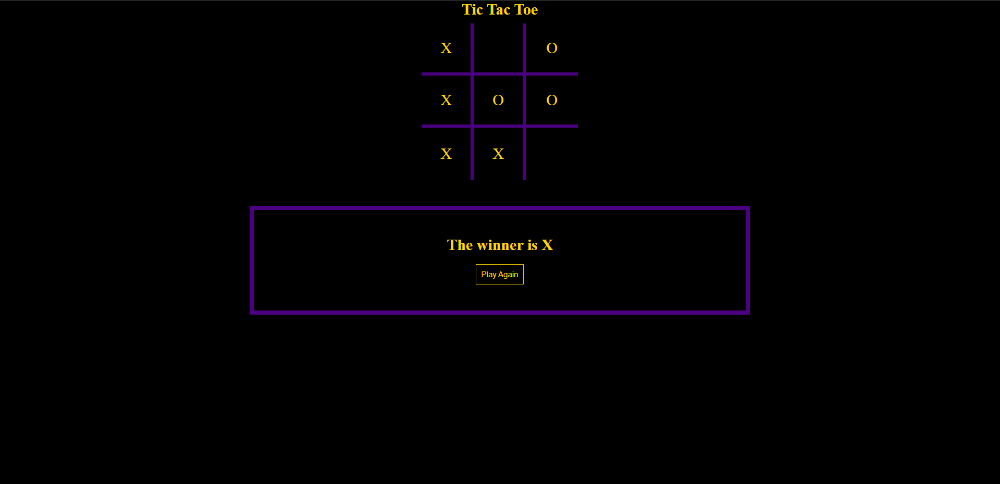

<h1 align="center">Tic Tac Toe App</h1>

<p align="center">
  
</p>

<p align="center">
  <a href="https://iuliangabriel.github.io/Tic-Tac-Toe/" style="display:inline-block;">Live App</a>
</p>

## Overview

This project is a web-based version of Tic Tac Toe, where two players can take turns making moves on a 3x3 grid. The goal is to achieve a row, column, or diagonal filled with their symbol (X or O).

## Features

- **Player Turns**: Two players can take turns to make their moves.
- **Winning Conditions**: The game checks for winning conditions after each move.
- **Reset**: Option to reset the game and start over.
- **Responsive Design**: Playable on various devices and screen sizes.

## Technologies Used

- HTML5
- CSS3
- JavaScript

## Installation

1. Clone the repository:

   ```bash
   git clone https://github.com/IulianGabriel/Tic-Tac-Toe
